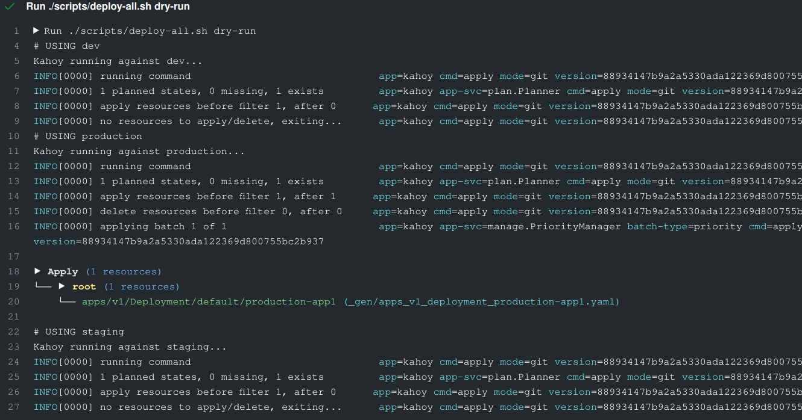
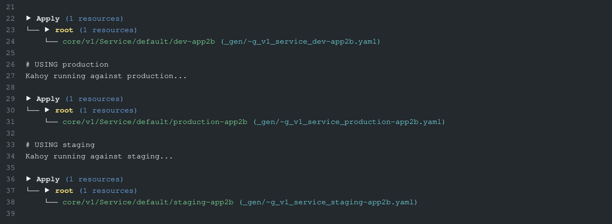
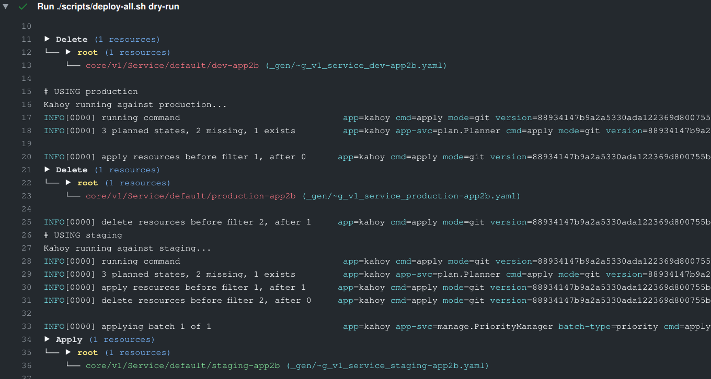

# Kahoy kustomize example

This repository is an example of how to use [Kahoy] and [Kustomize] (one way).

The example uses [Kustomize] with multiple envs and apps, but could be simplified and use [Kahoy] to deploy a single app (to one or multiple envs).

This Example uses github actions, but if you want to see an explained example of using github actions and [Kahoy] check [this][ga-kahoy-example]

## Structure

- [`base`](base): Kustomize base manifests.
- [`overlays`](overlays): Kustomize environments that that _customize_ our base manifests.
- [`_gen`](_gen): The manifests Kustomize generates and the ones that will be deployed with Kahoy.
- [`.github`](.github): What triggers [Kahoy] and has the magic for our gitops based system.
- [`scripts`](scripts): Helper deployment scripts.

## How does it work

### Manifest generation

- We will have our apps (app1, app2, app3...) in the `base` directory.
- We will have one path for each environment in `overlays` (production, staging, dev...).
- Using `make gen`, our repository will generate the required manifests in `_gen`.
- `_gen` Will have all the manifests generated for all the environments.

### CI and Deployment

- Our CI has a check step, that will generate the manifests, and if they are not the same as the ones committed it will fail. This ensures that we have generated the latest state
- On _non-master_ branches we will deploy with [Kahoy] using `dry-run` and `diff` on every environment, but ony the resources that changed ([Kahoy] will detect also resource deletions and will delete them).
- On _master_ branch we will deploy our manifest changes using [Kahoy] on each environment.
- We have every hour a scheduled pipeline that syncs all the repository with the master (in case something/someone changed manually things on the cluster).

## Kahoy execution

We give Kahoy `_gen` directory as the root of the manifest but, to split between Kahoy executions to different environments we filter the resources per environment using `--kube-include-label` (or `-l`) flag.

We can do this because all customize evn/overlays have `env` set as a common label on the `kustomization.yaml` file, e.g:

```yaml
commonLabels:
  env: staging
```

So we do something like:

```bash
kahoy apply \
    --dry-run \
    --include-changes \
    --git-before-commit-sha "...whatever..." \
    --fs-new-manifests-path "./_gen" \
    -l "env=staging"
```

If you check [deploy.sh](scripts/deploy.sh), you will see that we can deploy to an env using `CLUSTER_ENV` var.

To deploy to all envs we use [deploy-all.sh](scripts/deploy-all.sh), is just a helper script to call [deploy.sh](scripts/deploy.sh) for each of the envs declared on `overlays`, so in the end, we will invoke kahoy once for each env.

This way of deploying is just one way to use the power of Kahoy to deploy to multiple envs:

- Dry-run to all envs.
- Diff to all envs.
- Sync to all envs.

**Kahoy detects changes so only the envs that have changed will be deployed**

## K8s auth

This example doesn't show how you can set up Kubectl for each env. TODO.

## Examples and use cases

### Non updated Kustomize gen manifests should fail

In this PR, we pushed a change that changed the overlays but not generated the manifests. Our CI check step has failed because of this (to fix we have done `make gen` and commit the changes).

- [commit with error](https://github.com/slok/kahoy-kustomize-example/pull/3/commits/2ade2b1c0e8e25d808019ec8af9c28e9cbbd5473)
- [commit fixed](https://github.com/slok/kahoy-kustomize-example/pull/3/commits/8661d26a136e3249b5620e597f6da252da47b4a0)
- [Check execution](https://github.com/slok/kahoy-kustomize-example/runs/1062359894?check_suite_focus=true)

### Change on one env, Deploys changed resource on one env

In this PR we changed the number of replicas of a `Deployment` on the production environment (overlay). This will trigger a single deployment on that env



- [PR](https://github.com/slok/kahoy-kustomize-example/pull/3/)
- [Dry-run execution](https://github.com/slok/kahoy-kustomize-example/runs/1062370478)

### Change multiple envs

In this PR we have added a new service to `app2`, this triggered that all envs now have this new service. Kahoy detects changes in all envs and deploys all of them.



- [PR](https://github.com/slok/kahoy-kustomize-example/pull/4)
- [Dry-run execution](https://github.com/slok/kahoy-kustomize-example/runs/1062437228?check_suite_focus=true)

### Delete on some envs, change on others

In this PR, we have removed the second service of `app2` from all the envs, and add only to the staging environment, this triggered, the deletion of the service in `production` and `dev` environments, and the `apply` on the `staging` one.



- [PR](https://github.com/slok/kahoy-kustomize-example/pull/5)
- [Dry-run execution](https://github.com/slok/kahoy-kustomize-example/pull/5/checks?check_run_id=1062484964)

[kustomize]: https://kustomize.io/
[kahoy]: https://github.com/slok/kahoy
[ga-kahoy-example]: https://github.com/slok/kahoy-github-actions-example
